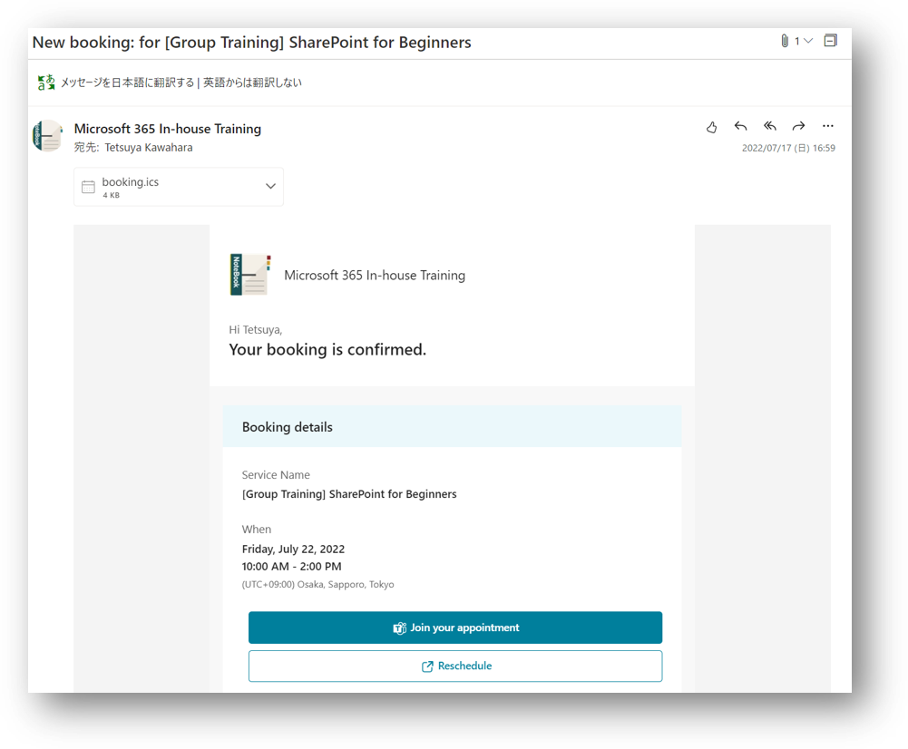

# 社内研修予約ページを Microsoft Bookings で作ってみた！
Microsoft Bookings を触ったことがなかったので、試しに次のような社内研修&1on1予約ページを作成してみました。

| 研修サービス                              | 講師                                                                                                           | 開催日                                                                                                               | 研修時間 [hour] | 受講可能人数 [人]              | 受講料 [円] | 開催場所       |
| ----------------------------------------- | -------------------------------------------------------------------------------------------------------------- | -------------------------------------------------------------------------------------------------------------------- | --------------- | ------------------------------ | ----------- | -------------- |
| [Group Training] SharePoint for Beginners | ・Adele Vance                                                                                                  | ・2022/07/22 10:00 ~ 14:00 ・2022/07/25 10:00 ~ 14:00                                                             | 4               | 6                              | 価格未設定  | オンライン会議 |
| [Group Training] List Formatting          | ・Tetsuya Kawahara                                                                                             | ・2022/07/20 09:30 ~ 11:30 ・2022/07/20 14:00 ~ 16:00 ・2022/07/22 15:00 ~ 17:00 ・2022/07/27 10:00 ~ 12:00 | 2               | 5                              | 価格未設定  | オンライン会議 |
| [Group Training] SharePoint Syntex        | ・Alex Wilber                                                                                                  | ・2022/07/19 10:00 ~ 15:00 ・2022/07/28 09:00 ~ 14:00                                                             | 5               | 5                              | 価格未設定  | オンライン会議 |
| [1 on 1] Ask Me Anything - 30 min         | ・Adele Vance ・Alex Wilber ・Diego Siciliani ・Grady Archie  ・Joni Sherman ・Tetsuya Kawahara | ・講師が空いている時間                                                                                               | 0.5             | 講師 1 人に対して 1 人受講可能 | 価格未設定  | オンライン会議 |
| [1 on 1] Ask Me Anything - 1 hour         | ・Adele Vance ・Alex Wilber ・Diego Siciliani ・Grady Archie  ・Joni Sherman ・Tetsuya Kawahara | ・講師が空いている時間                                                                                               | 1               | 講師 1 人に対して 1 人受講可能 | 価格未設定  | オンライン会議 |

予約ページで予約するときの動作イメージは、次の通りです。

予約時にメールアドレスを入力し、予約すると、次のようなメールが予約者に送付されます。

以下に、上記予約ページを作成したときの手順を記載します。 
※詳細には記載しておらず、メモ程度です。自分で後で思い出す用です。 
※初めて触ったため、間違ったことが記載されている可能性があります。 

## 予約ページの作成・通知手順（Japanese）
1. [予定表の作成](ja/10-Bookingsの予定表の作成.md)
2. [指定日時に開催する研修サービスの登録](ja/20-指定日時に開催する研修サービスの登録.md)
3. [講師の空き時間に予約できる研修サービスの登録](ja/30-講師の空き時間に予約できる研修サービスの登録.md)
4. [指定日時に開催する研修サービスの開催日時の登録](ja/40-指定日時に開催する研修サービスの開催日時の登録.md)
5. [予約ページの設定変更](ja/50-予約ページの設定変更.md)
6. [予約ページの通知](ja/60-予約ページの通知.md)

## 作成手順（English）

## 関連リンク（Japanese）
- [Microsoft Docs - Microsoft Bookings](https://docs.microsoft.com/ja-jp/microsoft-365/bookings/bookings-overview?view=o365-worldwide&WT.mc_id=M365-MVP-5004242)
- [Microsoft Docs - Microsoft Teams で Bookings アプリを管理する](https://docs.microsoft.com/ja-jp/microsoftteams/bookings-app-admin?WT.mc_id=M365-MVP-5004242)
- [Microsoft Learn - Microsoft Bookings でスケジュールを自動化する](https://docs.microsoft.com/ja-jp/learn/modules/automate-scheduling-microsoft-bookings/?WT.mc_id=M365-MVP-5004242)

## 関連リンク（English）
- [Microsoft Docs - Microsoft Bookings](https://docs.microsoft.com/en-us/microsoft-365/bookings/bookings-overview?view=o365-worldwide&WT.mc_id=M365-MVP-5004242)
- [Manage the Bookings app in Microsoft Teams](https://docs.microsoft.com/en-us/microsoftteams/bookings-app-admin?WT.mc_id=M365-MVP-5004242)
- [Microsoft Learn - Automate scheduling with Microsoft Bookings](https://docs.microsoft.com/en-us/learn/modules/automate-scheduling-microsoft-bookings/?WT.mc_id=M365-MVP-5004242)