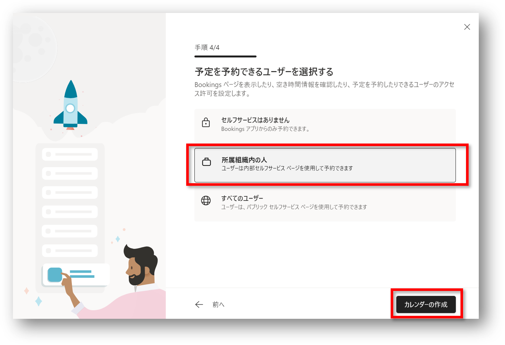
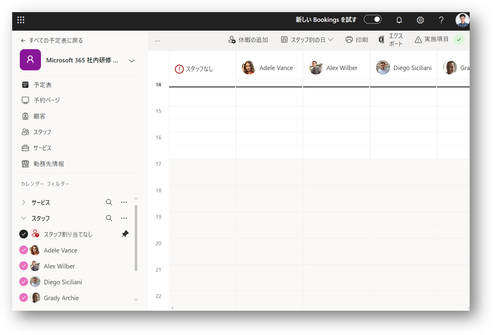

# Bookings の予定表の作成

1. [Microsoft Bookings](https://outlook.office.com/bookings/homepage) にアクセス
2. [+ 新しいカレンダー] をクリック 

3. [最初から作成] をクリック
4. 「名前」「業種」「勤務時間」を入力
5. [次へ] をクリック 

6. スタッフとして、講師を追加（今回は、全員をスタッフとして各研修に割り当てたいので、全員をチームメンバーとして追加） 
※ロールの一覧とその権限については、[Microsoft Docs - Bookings にスタッフを追加する](https://docs.microsoft.com/ja-jp/microsoft-365/bookings/add-staff?view=o365-worldwide#steps) を参照
7. [次へ] をクリック 

8. サービス（研修）を１つ設定（この時点では１つしか設定できなかった。後から複数のサービスを登録できる。）
9. [次へ] をクリック 

10. 「予定を予約できるユーザー」を選択（今回は、"社内" 研修なので「所属組織内の人」を選択）
11. [カレンダーの作成] をクリック 

12. 予定表完成画面が表示される
13. [始める] をクリック 

14. 予定表のページが表示され、予定表の作成が完了 
