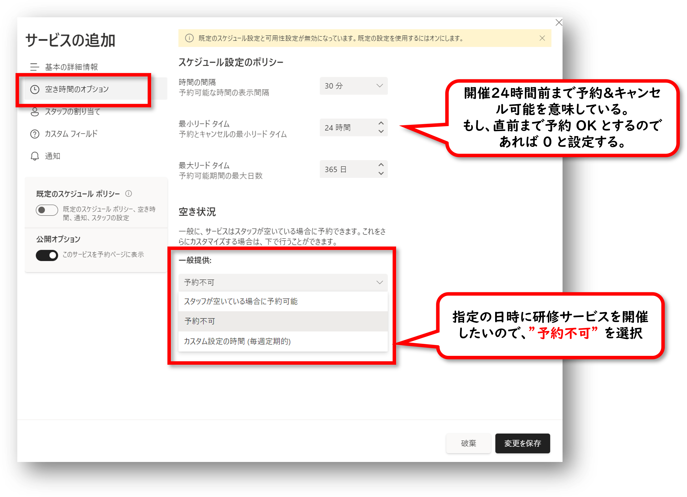

# 指定日時に開催する研修サービスの登録

次の表に記載されている指定日時に開催する研修サービスの登録方法です。 
※この手順では、研修 "開催日時" の登録はせず、研修サービスの内容を登録します。「研修マスターの登録」と考えると分かりやすいかと思います。

| 研修サービス                              | 講師               | 開催日                                                                                                               | 研修時間 [hour] | 受講可能人数 [人] | 受講料 [円] | 開催場所       |
| ----------------------------------------- | ------------------ | -------------------------------------------------------------------------------------------------------------------- | --------------- | ----------------- | ----------- | -------------- |
| [Group Training] SharePoint for Beginners | ・Adele Vance      | ・2022/07/22 10:00 ~ 14:00 ・2022/07/25 10:00 ~ 14:00                                                             | 4               | 6                 | 価格未設定  | オンライン会議 |
| [Group Training] List Formatting          | ・Tetsuya Kawahara | ・2022/07/20 09:30 ~ 11:30 ・2022/07/20 14:00 ~ 16:00 ・2022/07/22 15:00 ~ 17:00 ・2022/07/27 10:00 ~ 12:00 | 2               | 5                 | 価格未設定  | オンライン会議 |
| [Group Training] SharePoint Syntex        | ・Alex Wilber      | ・2022/07/19 10:00 ~ 15:00 ・2022/07/28 09:00 ~ 14:00                                                             | 5               | 5                 | 価格未設定  | オンライン会議 |

1. 予定表のページを開く
2. サイドメニューの [サービス] をクリック
3. [+ 新しいサービスの追加] をクリック 

4. 研修サービス内容を登録
   - 基本の詳細情報 
   - 空き時間のオプション 
   - スタッフの割り当て 
   - カスタムフィールド 
   - 通知 

5. 登録が終わったら [変更を保存] をクリック 

6. サービスの登録が完了し、サービス一覧に登録した研修サービスが表示される 

7. 同様の手順で「[Group Training] List Formatting」と「[Group Training] SharePoint Syntex」も登録 

以上で、指定日時に開催する研修サービスの登録は完了