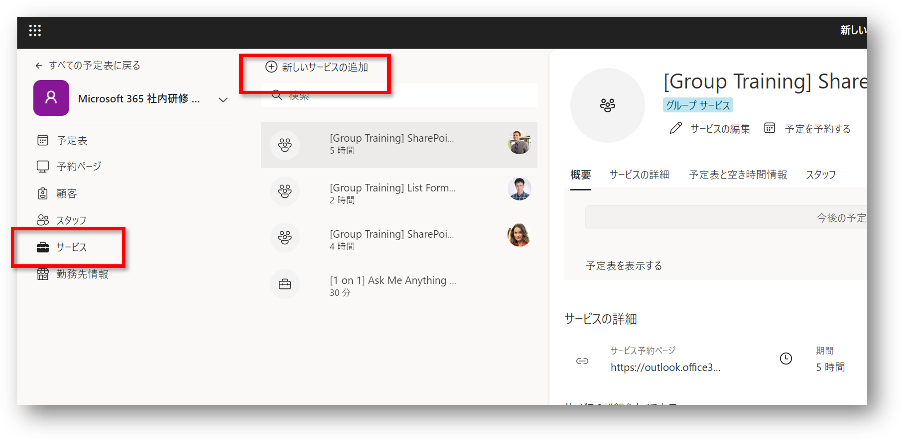
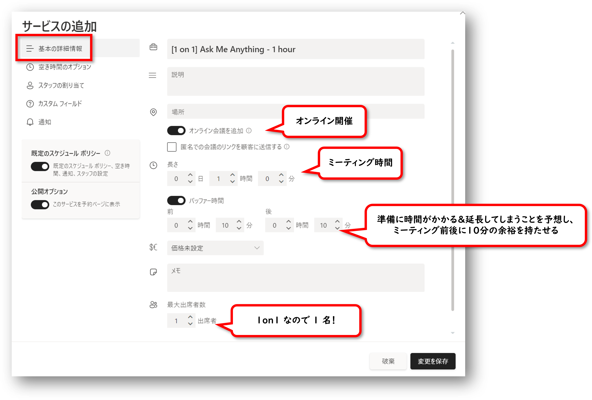
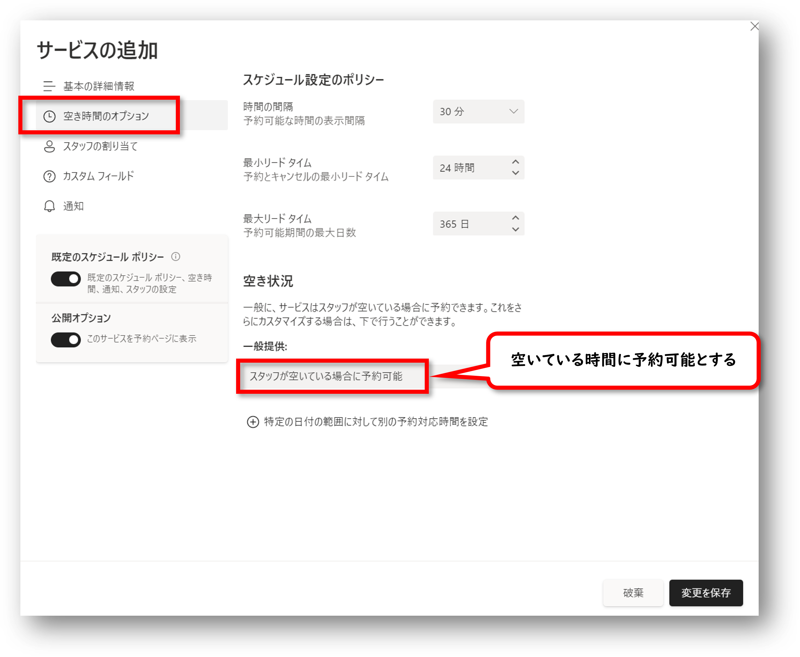
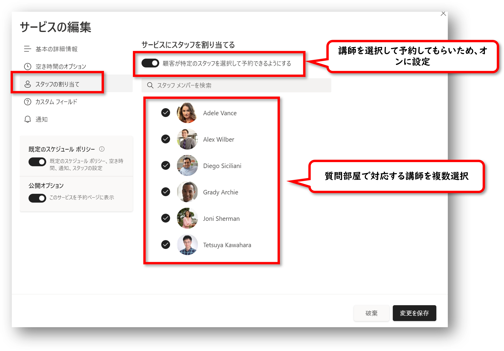
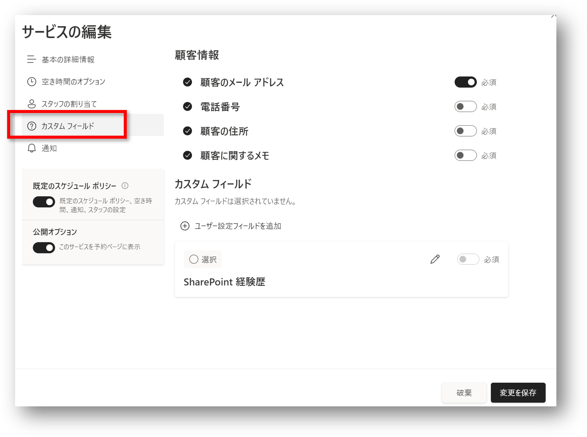
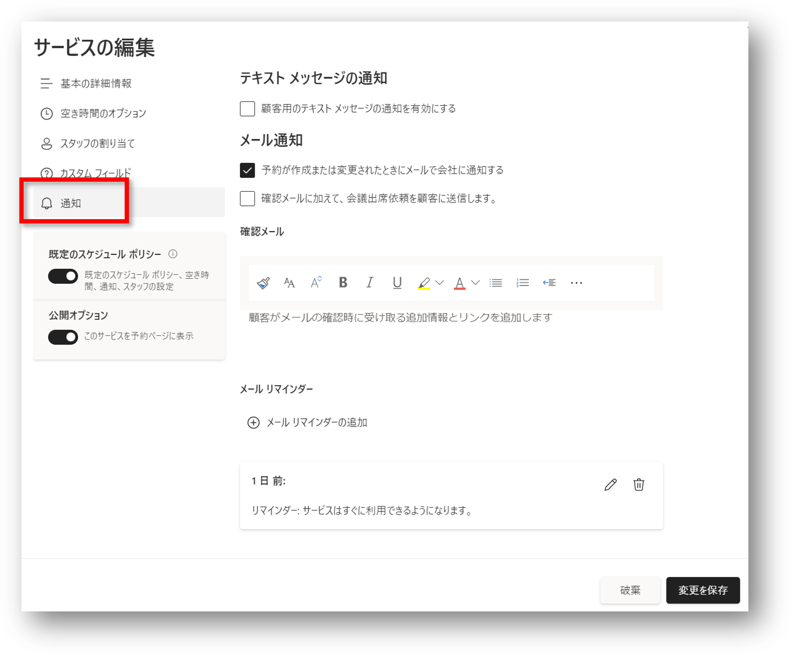
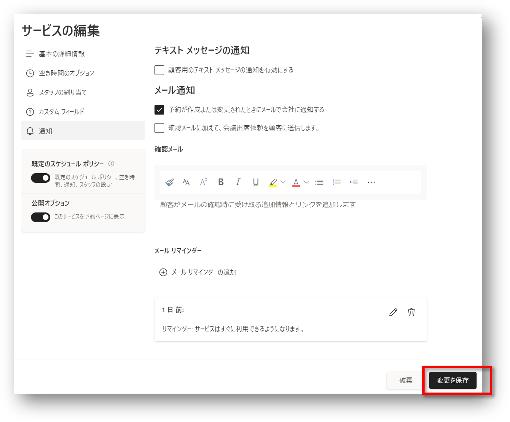
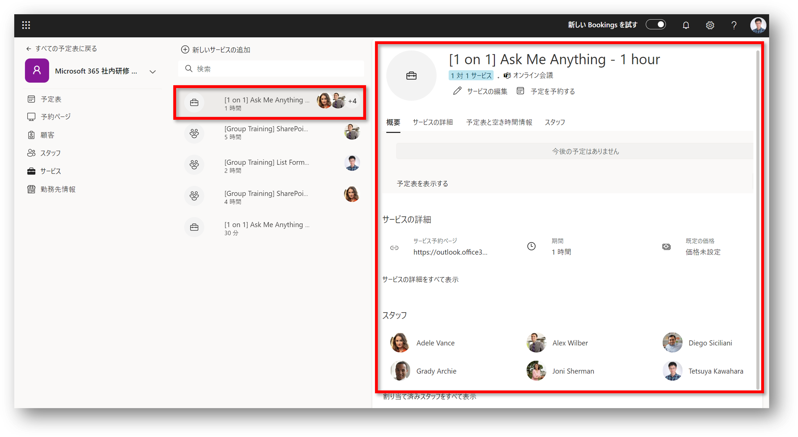
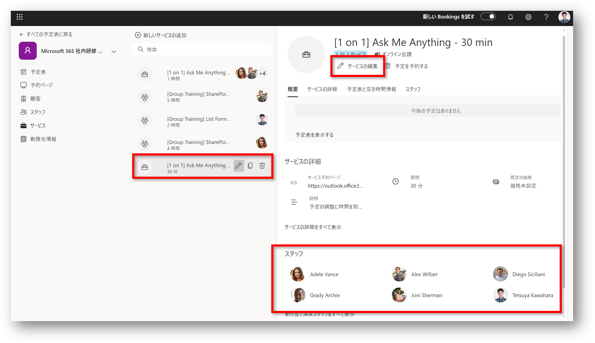

# 講師の空き時間に予約できる研修サービスの登録

次の表に記載されている講師の空き時間に予約できる研修サービスの登録方法です。 

| 研修サービス                                  | 講師                                                                                                           | 開催日                                                                                                               | 研修時間 [hour] | 受講可能人数 [人]              | 受講料 [円] | 開催場所       |
| ----------------------------------------- | -------------------------------------------------------------------------------------------------------------- | -------------------------------------------------------------------------------------------------------------------- | --------------- | ------------------------------ | ----------- | -------------- |
| [1 on 1] Ask Me Anything - 30 min         | ・Adele Vance ・Alex Wilber ・Diego Siciliani ・Grady Archie  ・Joni Sherman ・Tetsuya Kawahara | ・講師が空いている時間                                                                                               | 0.5             | 講師 1 人に対して 1 人受講可能 | 価格未設定  | オンライン会議 |
| [1 on 1] Ask Me Anything - 1 hour         | ・Adele Vance ・Alex Wilber ・Diego Siciliani ・Grady Archie  ・Joni Sherman ・Tetsuya Kawahara | ・講師が空いている時間                                                                                               | 1               | 講師 1 人に対して 1 人受講可能 | 価格未設定  | オンライン会議 |

1. 予定表のページを開く
2. サイドメニューの [サービス] をクリック
3. [+ 新しいサービスの追加] をクリック 

4. 研修サービス内容を登録
   - 基本の詳細情報 
   - 空き時間のオプション 
   - スタッフの割り当て 
   - カスタムフィールド 
   - 通知 

5. 登録が終わったら [変更を保存] をクリック 

6. サービスの登録が完了し、サービス一覧に登録した研修サービスが表示される 

7. 「[[1 on 1] Ask Me Anything - 30 min」の内容を編集、スタッフを追加 

以上で、講師の空き時間に予約できる研修サービスの登録は完了