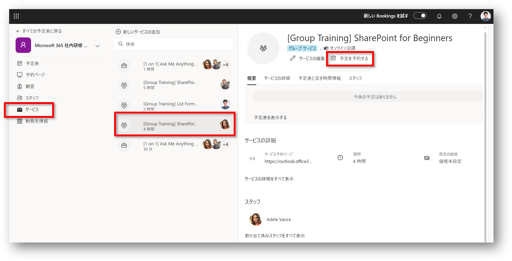
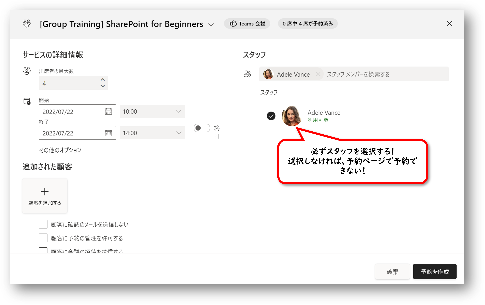
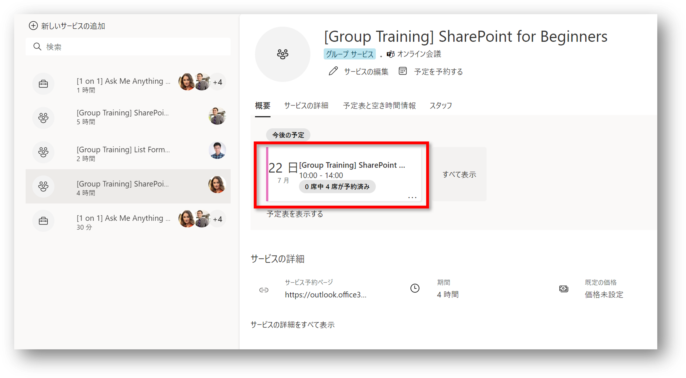
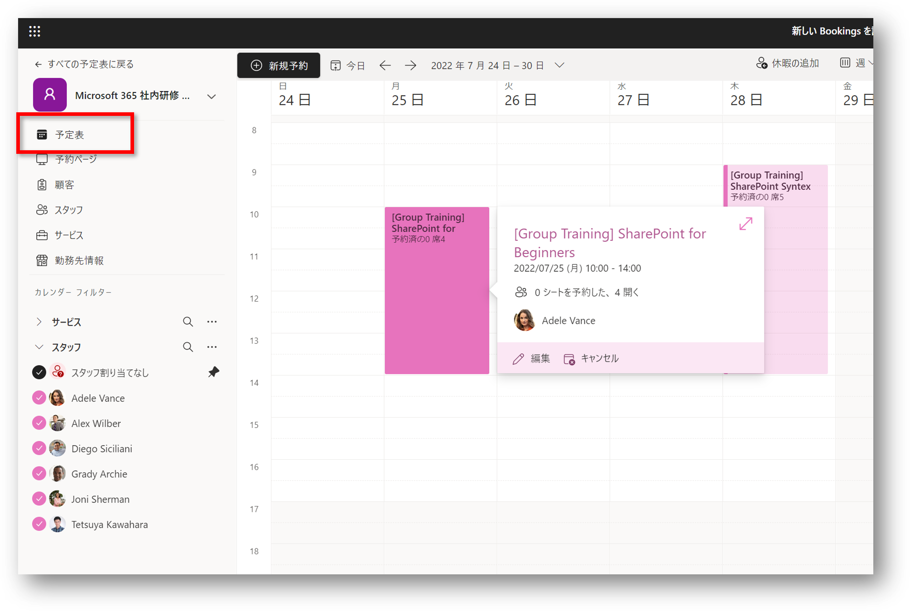

# 指定日時に開催する研修サービスの開催日時の登録

[指定日時に開催する研修サービスの登録](20-指定日時に開催する研修サービスの登録.md) で登録した研修サービスの開催日時を登録します。

1. 予定表のページを開く
2. サイドメニューの [サービス] をクリック
3. 指定日時に開催する研修サービスをクリック
4. [予定を予約する] をクリック 

5. 開催日時、スタッフ等を入力
6. [予約を作成] をクリック 

7. サービスの詳細画面に作成した予約が表示される

8. 同様の手順で各研修の開催日時を登録

以上で、指定日時に開催する研修サービスの開催日時の登録は完了

※サイドメニューの [予定表] で開催日時を登録した研修サービスの予約を確認することができます。
